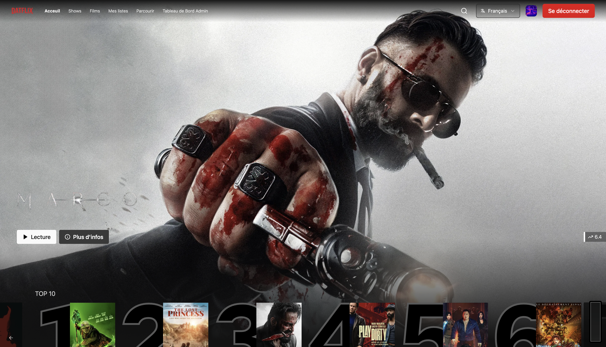
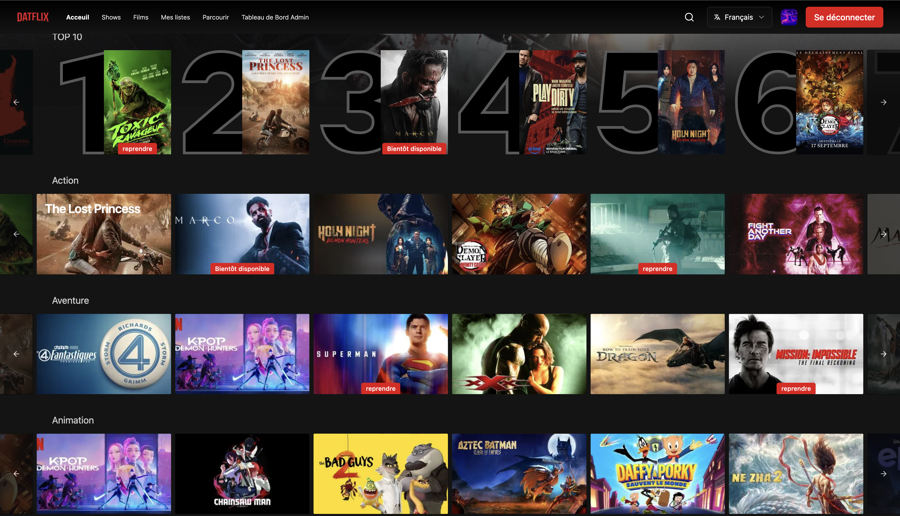
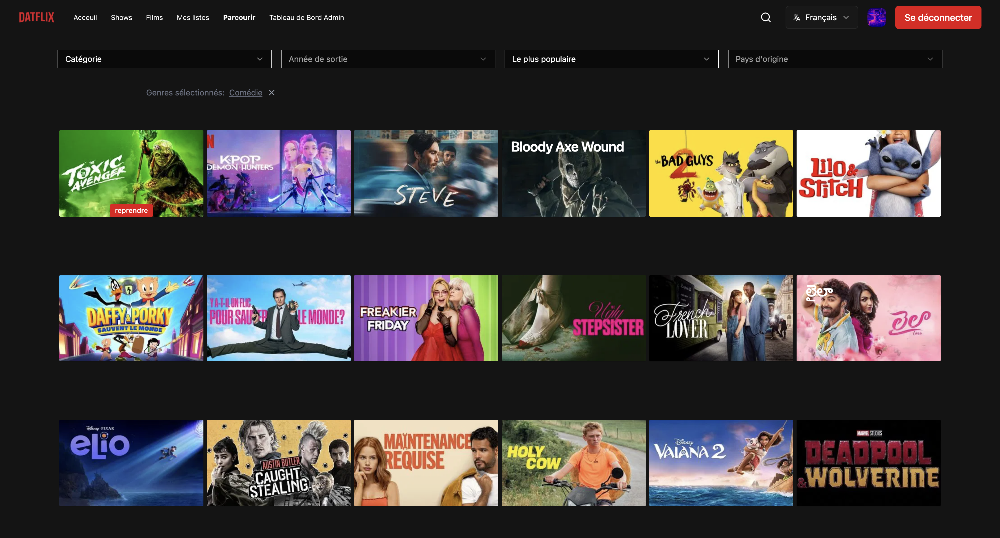
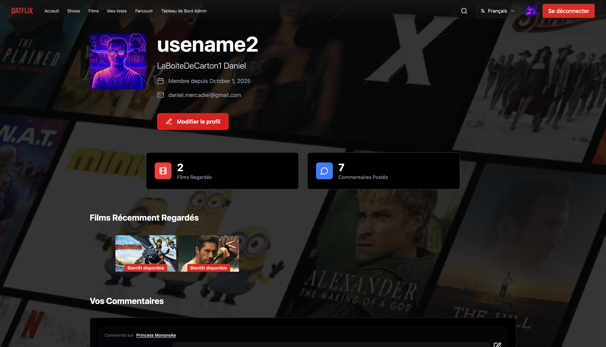
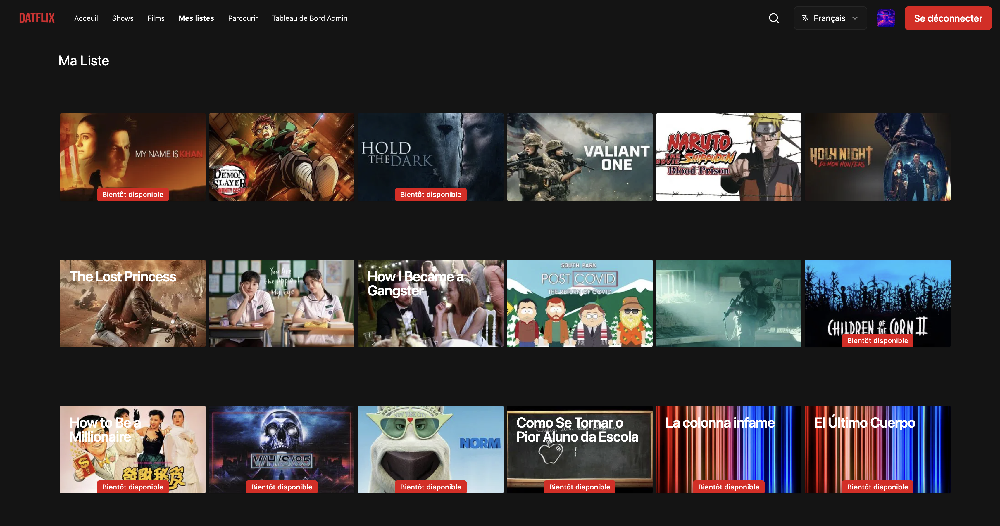
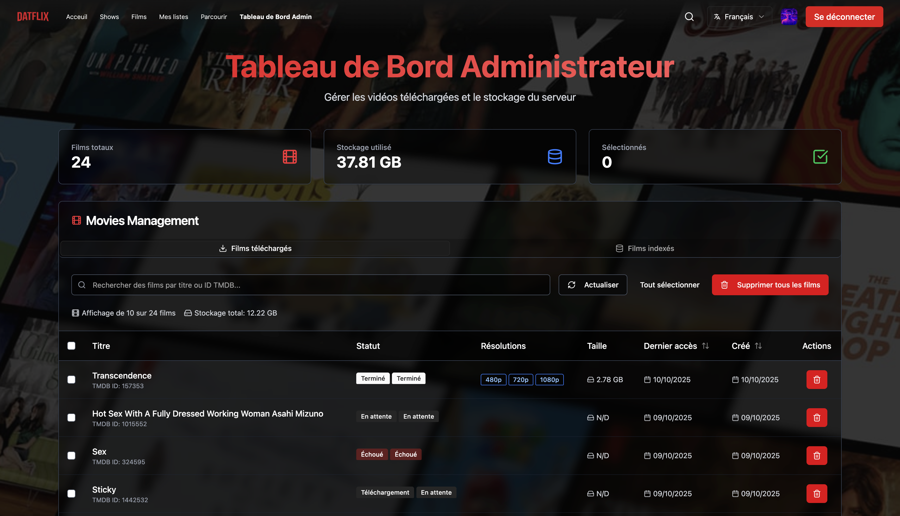

# 🎬 Hypertube

*A modern, feature-rich streaming platform inspired by Netflix with torrent integration*

[](https://www.typescriptlang.org/)
[](https://kit.svelte.dev/)
[](https://adonisjs.com/)
[](https://www.postgresql.org/)
[](https://www.docker.com/)

## 🌟 Overview

Hypertube is a comprehensive streaming platform that combines the user experience of modern streaming services with the versatility of torrent technology. Built with cutting-edge web technologies, it offers seamless movie streaming, intelligent torrent integration, and a rich set of features for both users and administrators.


*Modern Netflix-like interface with movie carousel and featured content*

---

## ✨ Key Features

### 🎭 Core Streaming Features
- **Real-time Streaming**: Progressive HLS video conversion with multiple quality options (480p, 720p, 1080p)
- **Smart Torrent Integration**: Automatic torrent search and download from multiple providers
- **Subtitle Support**: Multi-language subtitle download from OpenSubtitles with automatic sync
- **Progressive Download**: Start watching while content is still downloading
- **Resume Playback**: Automatic progress tracking and resume functionality

### 🎨 User Experience
- **Netflix-like Interface**: Modern, responsive design with smooth animations
- **Advanced Search**: Multi-language movie search with TMDB integration
- **Personal Library**: Bookmarks, watch history, and personalized recommendations
- **Multi-language Support**: Available in English, French, Spanish, Arabic, and Chinese

### 🔐 Authentication & Social Features
- **Multi-provider OAuth**: Login with Google, GitHub, Discord, or 42 School
- **User Profiles**: Customizable profiles with avatar support
- **Social Features**: Comments on movies, user interactions
- **Admin Panel**: Comprehensive administration tools for content management

### 🛠️ Technical Excellence
- **Microservices Architecture**: Monorepo with separate frontend and backend services
- **Real-time Processing**: FFmpeg integration for on-the-fly video conversion
- **Smart Caching**: Intelligent content caching and cleanup systems
- **Performance Optimized**: Touch-optimized mobile experience with passive event listeners


*Responsive movie carousel with smooth animations and intuitive navigation*

---

## 🏗️ Architecture

<!-- **📊 INSERT ARCHITECTURE DIAGRAM HERE** -->

### Frontend (SvelteKit)
- **Framework**: SvelteKit 5.0 with TypeScript
- **Styling**: Tailwind CSS 4.0 with custom components
- **Video Player**: Video.js with HLS support
- **UI Components**: Embla Carousel, custom component library
- **Internationalization**: svelte-i18n with 5 supported languages

### Backend (AdonisJS)
- **Framework**: AdonisJS 6.17 with TypeScript
- **Database**: PostgreSQL with Lucid ORM
- **Authentication**: Multi-provider OAuth + JWT tokens
- **File Processing**: FFmpeg for video conversion
- **APIs**: TMDB for movie data, OpenSubtitles for subtitles

### Infrastructure
- **Deployment**: Docker Compose with multi-service setup
- **Package Management**: PNPM with Turborepo monorepo
- **Development**: Hot reload, TypeScript, ESLint configuration

---

## 🚀 Getting Started

### Prerequisites

- **Node.js**: v18+ required
- **PNPM**: Package manager
- **Docker**: For containerized deployment
- **PostgreSQL**: Database (included in Docker setup)

### Quick Start (Recommended)

**🚀 One-command deployment:**

```bash
git clone <repository-url>
cd Hypertube
make prod-deploy
```

That's it! The Makefile handles everything:
- ✅ Environment setup
- ✅ Dependencies installation  
- ✅ Database startup
- ✅ Migrations
- ✅ Production build
- ✅ Server startup

**Alternative deployment methods:**

**Development mode (faster startup):**
```bash
make deploy  # For development with hot-reload
```

**Docker-only deployment:**
```bash
cp ./apps/back/.env.example ./apps/back/.env
cp ./apps/front/.env.example ./apps/front/.env
docker compose up -d
```

**Access the application:**
- Frontend: http://localhost:5173
- Backend API: http://localhost:3333
- Admin Panel: http://localhost:5173/admin

### Environment Configuration

**Backend (`apps/back/.env`)**:
```env
# Database
DB_HOST=localhost
DB_PORT=5432
DB_USER=postgres
DB_PASSWORD=password
DB_DATABASE=hypertube

# TMDB API
TMDB_API_KEY=your_tmdb_api_key
TMDB_API_URL=https://api.themoviedb.org/3

# OAuth Providers
GITHUB_CLIENT_ID=your_github_client_id
GITHUB_CLIENT_SECRET=your_github_client_secret
GOOGLE_CLIENT_ID=your_google_client_id
GOOGLE_CLIENT_SECRET=your_google_client_secret
DISCORD_CLIENT_ID=your_discord_client_id
DISCORD_CLIENT_SECRET=your_discord_client_secret
FORTYTWO_CLIENT_ID=your_42_client_id
FORTYTWO_CLIENT_SECRET=your_42_client_secret

# OpenSubtitles
OPENSUBTITLES_API_KEY=your_opensubtitles_key
OPENSUBTITLES_USERNAME=your_username
OPENSUBTITLES_PASSWORD=your_password

# URLs
FRONT_URL=http://localhost:5173
BACK_URL=http://localhost:3333
```

**Frontend (`apps/front/.env`)**:
```env
PUBLIC_BACK_URL=http://localhost:3333
SECRET_BACK_REDIRECT_URL=http://localhost:3333
```

---

## 📱 Features Deep Dive

### 🎬 Video Streaming Engine


*Movie details page with video player interface and quality selector*

The streaming engine uses progressive HLS conversion:

- **Torrent Integration**: Searches multiple torrent providers (YTS, ThePirateBay)
- **Real-time Conversion**: FFmpeg converts video to HLS format on-the-fly
- **Multiple Qualities**: Simultaneous encoding to 480p, 720p, and 1080p
- **Smart Buffering**: Progressive loading allows immediate playback


*Full homepage view showing trending movies, categories, and responsive design*

### 🔍 Advanced Search & Discovery


*Advanced search and discovery with filters, genres, and movie cards*

- **TMDB Integration**: Access to millions of movies and TV shows
- **Multi-language Results**: Localized content and metadata
- **Smart Filtering**: By genre, year, cast, rating, and availability
- **Torrent Availability**: Real-time checking of streaming availability

### 👤 User Management


*User profile with watch history, preferences, and personal collections*

- **OAuth Integration**: Seamless login with major providers
- **Profile Customization**: Avatar upload, preferences, settings
- **Watch History**: Comprehensive tracking with resume functionality
- **Personal Collections**: Bookmarks and custom lists


*Personal movie collection with bookmarks and custom lists management*

### 🛡️ Admin Dashboard


*Comprehensive admin interface with movie management and system statistics*

- **Content Management**: Movie database administration
- **User Management**: User accounts and permissions
- **System Monitoring**: Download status, storage usage, performance metrics
- **Cleanup Tools**: Automated old content removal

---

## 🛠️ API Documentation

### Authentication Endpoints

```typescript
POST /auth/login              // Standard login
POST /auth/register           // User registration
POST /auth/logout             // Logout
GET  /auth/{provider}/redirect // OAuth redirect
GET  /auth/{provider}/callback // OAuth callback
POST /auth/forgot-password    // Password reset request
POST /auth/reset-password     // Password reset confirmation
```

### Movie Endpoints

```typescript
GET  /movies/search           // Search movies
GET  /movies/discover         // Discover movies with filters
GET  /movies/popular          // Popular movies
GET  /movies/similar          // Similar movies
GET  /movies/genres           // Available genres
GET  /movies/{id}             // Movie details
GET  /movies/{id}/credits     // Movie cast & crew
```

### Streaming Endpoints

```typescript
POST /torrent/{id}            // Start movie download
GET  /torrent/ready/{id}      // Check conversion status
GET  /stream/*                // HLS video streaming
DELETE /torrent/{id}          // Remove movie
```

### User Endpoints

```typescript
GET  /users/{username}        // User profile
PUT  /users/{username}        // Update profile
POST /users/{id}/watch        // Mark as watched
POST /users/{id}/bookmark     // Add to bookmarks
GET  /users/{id}/progress     // Watch progress
```

---

## 🎯 Usage Examples

### Basic Movie Search

```javascript
// Search for movies
const response = await fetch('/api/movies/search?query=inception');
const { movies, hasMorePages } = await response.json();

// Get movie details
const movie = await fetch('/api/movies/550'); // Fight Club
const details = await movie.json();
```

### Starting a Stream

```javascript
// Check if movie is available for streaming
const availability = await fetch('/api/torrent/550');

// Start download if available
if (availability.ok) {
  const download = await fetch('/api/torrent/550', { method: 'POST' });
  
  // Monitor conversion progress
  const status = await fetch('/api/torrent/ready/550');
  const { resolutions } = await status.json();
}
```

### User Authentication

```javascript
// OAuth login
window.location.href = '/auth/google/redirect';

// Check authentication status
const user = await fetch('/api/auth/me');
if (user.ok) {
  const userData = await user.json();
}
```

---

## 🔧 Configuration

### Video Quality Settings

The system supports multiple quality presets defined in `torrent_service.ts`:

```typescript
private getQualitySettings(width: number) {
  const settings = {
    480: { crf: 28, videoBitrate: '1000k', audioBitrate: '128k' },
    720: { crf: 25, videoBitrate: '2500k', audioBitrate: '192k' },
    1080: { crf: 23, videoBitrate: '5000k', audioBitrate: '256k' }
  };
  return settings[width] || settings[720];
}
```

### Supported Languages

Subtitle support for multiple languages:

```typescript
const SUPPORTED_LANGUAGES = ['en', 'fr', 'es', 'ar', 'zh'];
```

### Cache Management

Automatic cleanup of old content:

- Movies not accessed for 30+ days are eligible for removal
- Configurable storage limits and cleanup schedules
- Smart cache invalidation for optimal performance

---

## 📚 Technology Stack

### Frontend Technologies
- **SvelteKit 5.0**: Full-stack framework with SSR
- **TypeScript**: Type-safe development
- **Tailwind CSS 4.0**: Utility-first styling
- **Video.js 8.23**: HTML5 video player
- **Embla Carousel 8.5**: Touch-friendly carousels
- **Svelte-i18n**: Internationalization

### Backend Technologies
- **AdonisJS 6.17**: Node.js framework
- **PostgreSQL**: Primary database
- **Lucid ORM**: Database abstraction
- **FFmpeg**: Video processing
- **Torrent-stream**: P2P downloading
- **Ally**: OAuth authentication

### DevOps & Tools
- **Turborepo**: Monorepo management
- **PNPM**: Fast package manager
- **Docker**: Containerization
- **ESLint/Prettier**: Code quality
- **GitHub Actions**: CI/CD (if configured)

---

## 🗂️ Project Structure

```
Hypertube/
├── apps/
│   ├── back/                 # AdonisJS Backend
│   │   ├── app/
│   │   │   ├── controllers/  # API endpoints
│   │   │   ├── models/       # Database models
│   │   │   ├── services/     # Business logic
│   │   │   └── middleware/   # Request middleware
│   │   ├── database/
│   │   │   └── migrations/   # Database schema
│   │   ├── config/           # App configuration
│   │   └── public/           # Static assets
│   │
│   └── front/                # SvelteKit Frontend
│       ├── src/
│       │   ├── routes/       # Page components
│       │   ├── lib/          # Utilities & components
│       │   └── app.html      # HTML template
│       └── static/           # Static assets
│
├── packages/
│   ├── shared/               # Shared types & utilities
│   ├── eslint-config/        # ESLint configuration
│   └── typescript-config/    # TypeScript configuration
│
├── compose.yaml              # Docker services
├── turbo.json               # Turborepo configuration
└── pnpm-workspace.yaml      # Workspace definition
```

---

## 🔒 Security

### Authentication Security
- **JWT Tokens**: Secure session management
- **OAuth 2.0**: Industry-standard social login
- **Password Hashing**: Argon2 for password security
- **CSRF Protection**: Built-in AdonisJS protection

### Content Security
- **Input Validation**: Comprehensive request validation
- **SQL Injection**: Protected via Lucid ORM
- **XSS Prevention**: Content sanitization
- **Rate Limiting**: API endpoint protection

### Infrastructure Security
- **Environment Variables**: Sensitive data protection
- **HTTPS**: Enforced in production
- **Docker Security**: Non-root containers
- **Database Security**: Connection encryption

---

## 📊 Performance

### Frontend Performance
- **Code Splitting**: Automatic route-based splitting
- **Image Optimization**: Responsive images with lazy loading
- **Touch Optimization**: Passive event listeners for smooth scrolling
- **Bundle Size**: Optimized with Vite and tree-shaking

### Backend Performance
- **Database Indexing**: Optimized queries with proper indexes
- **Caching Strategy**: Redis-ready architecture
- **Connection Pooling**: Efficient database connections
- **Background Jobs**: Async processing for heavy tasks

### Video Performance
- **Progressive Loading**: Start watching immediately
- **Multiple Qualities**: Adaptive bitrate streaming
- **Efficient Encoding**: Optimized FFmpeg settings
- **Smart Caching**: Intelligent file management

---

## 🐛 Troubleshooting

### Common Issues

**YouTube Player Warnings**
If you see warnings related to YouTube player in the console, you can disable the YouTube player component:

```env
# Frontend (.env)
PUBLIC_ENABLE_YOUTUBE=false
```

This will prevent YouTube-related warnings and improve performance if you're not using YouTube integration features.

**Database Connection Errors**
```bash
# Check PostgreSQL status
docker-compose ps postgres

# Reset database
docker-compose down -v
docker-compose up -d postgres
cd apps/back && node ace migration:run
```

**OAuth Login Problems**
- Verify client IDs and secrets in environment files
- Check redirect URLs in OAuth provider settings
- Ensure backend URL is accessible from frontend

**Port Conflicts**
- Backend default: 3333
- Frontend default: 5173
- PostgreSQL default: 5432


---

## 📄 License

This project is licensed under the MIT License. See [LICENSE](LICENSE) file for details.

---

## 🙏 Acknowledgments

- **TMDB**: Movie database and metadata
- **OpenSubtitles**: Subtitle service
- **AdonisJS Team**: Excellent backend framework
- **Svelte Team**: Revolutionary frontend framework
- **42 School**: Educational inspiration and OAuth provider

---

## 📞 Support

### Documentation
- [Backend API Docs](docs/api.md)
- [Frontend Components](docs/components.md)
- [Deployment Guide](docs/deployment.md)

### Community
- **Issues**: GitHub Issues for bug reports
- **Discussions**: GitHub Discussions for questions

### Professional Support
For enterprise support and custom implementations, contact: [support@hypertube.dev](mailto:support@hypertube.dev)

---

**Made with ❤️ and lots of ☕ by the Hypertube team**


